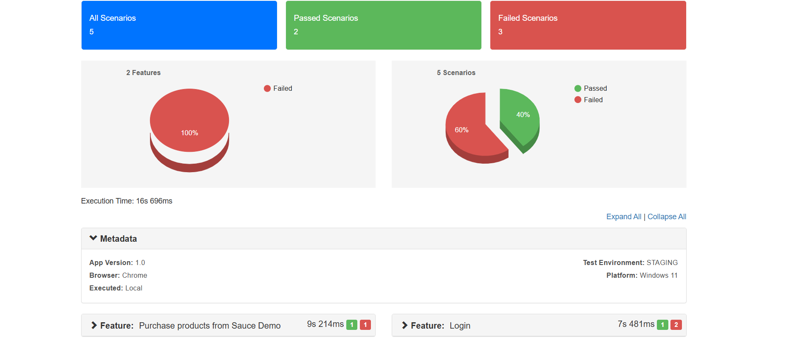

# E2E Automation Framework

This is a scalable and maintainable end-to-end (E2E) testing framework using **Cucumber**, **Playwright**, and **TypeScript** to automate user journeys on [saucedemo.com](https://www.saucedemo.com), a demo e-commerce platform.

It follows a Behavior-Driven Development (BDD) approach, enabling collaboration between technical and non-technical team members through human-readable test scenarios.

---

## 📦 Tech Stack

- **[Playwright](https://playwright.dev/):** Fast and reliable browser automation
- **[Cucumber.js](https://github.com/cucumber/cucumber-js):** BDD-style test writing
- **[TypeScript](https://www.typescriptlang.org/):** Strong typing and developer tooling
- **[Cucumber HTML Reporter](https://www.npmjs.com/package/cucumber-html-reporter):** Clean, shareable test reports

---

## 📁 Suggested Folder Structure

```

saucedemo/  
├── .git/  
│   └── COMMIT_EDITMSG  
├── features/  
│   ├── fixtures/  
│   ├── hooks/  
│   ├── pages/  
│   ├── step_definitions/  
│   ├── support/  
│   ├── config.ts  
│   ├── login.feature  
│   └── PurchaseItems.feature  
├── node_modules/  
├── reports/  
├── screenshots/  
├── tests/  
├── tests-examples/  
├── .gitignore  
├── cucumber.json  
├── generate-report.ts  
├── package-lock.json  
├── package.json  
├── playwright.config.ts  
├── README.md  
└── tsconfig.json

````

---

## 🧠 Design Considerations

- ✅ **Modular architecture** using Page Object Model (POM) for maintainability
- ✅ **Type-safe** codebase with TypeScript for reliability
- ✅ **Gherkin syntax** to write readable, behavior-driven tests
- ✅ **Separate layers** for test data, steps, and UI logic

---

## 🚀 Getting Started

### 1. Clone the Repository

```bash
git clone https://www.github.com/reenagarha/Cucumber-playwright

````
### 2. Pre requisites
```bash
Node.js (v16 or above)
npm (comes with Node.js)

````
### 3. Install Dependencies

```bash
# Core dependencies
npm install -D @playwright/test @cucumber/cucumber typescript ts-node

# For HTML reporting (optional)
npm install -D cucumber-html-reporter


```

---

##  Running Tests

### Run All Feature Tests

```bash
npm run test
```

> Runs Cucumber tests from `features/*.feature`

---

### Generate Test Report

```bash
npm run report
```

> Converts test results into an HTML report using `cucumber-html-reporter`.

---

### Combined: Run Tests and Generate Report

```bash
npm run test:report
```

> Runs tests and generates the HTML report even if tests fail.

---

 ### Optional :  Run Tagged test
``` bash

npx cucumber-js --tags "@smoke" 

```
> Runs tests tagged as smoke

---

## ✅ Sample Feature File

```bash
@smoke
Feature: Login functionality

  Scenario: Valid login
    Given I open the saucedemo website
    When I login with valid credentials
    Then I should see the inventory page
```

---

## 📊 Sample Test Report

After running `npm run report`, an HTML report will be generated (typically as `report.html`).
You can customize it via `generate-report.ts`.




---

## 🔁 Continuous Integration (Optional)

This framework is CI-ready and can be integrated with:

* **GitHub Actions**
* **GitLab CI**
* **Jenkins**
* **Azure DevOps**

> Trigger tests automatically on pull requests, merges, or scheduled runs.

---


## 👤 Author
*Reena Garha*

*Contact: [reenagarha@gmail.com](mailto:reenagarha@gmail.com)*
